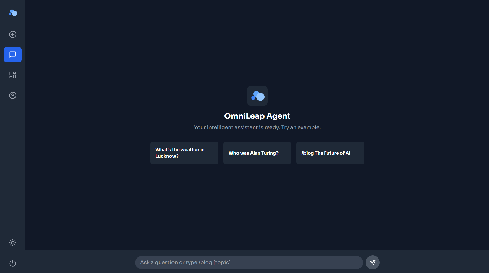
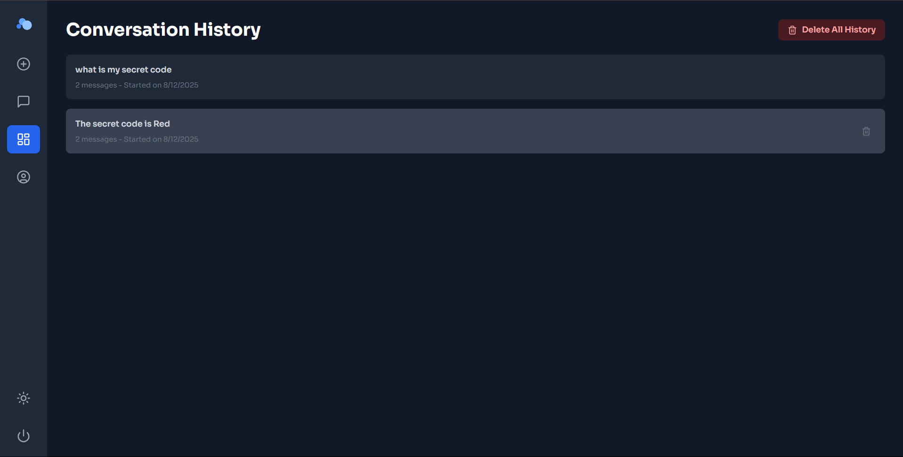
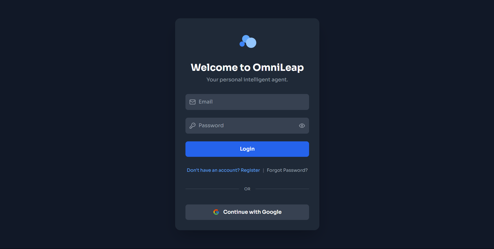
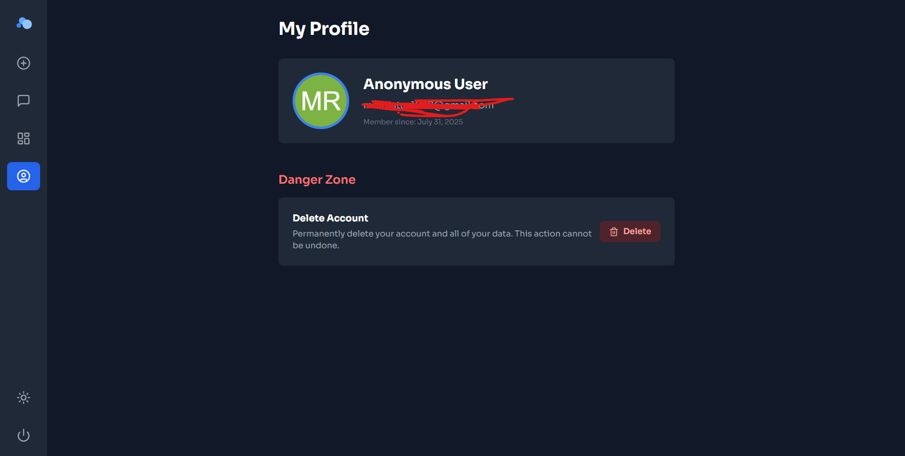

# OmniLeap AI Agent 🚀


> A full-stack **multi-tool AI agent** with **long-term memory**, **code execution**, and **multi-agent collaboration**.  
> Built with **Python + FastAPI** (backend) and **Next.js + React** (frontend), deployed on **Google Cloud Run** & **Vercel**.

---

## 🌐 Live Demo
🚀 **[Click here to try the app live](https://omni-leap-ai-agent.vercel.app)**

---

## 📸 Screenshots & Demo

| Chat Interface | Analytics Dashboard |
|---------------|--------------------|
|  |  |

| Login Page | Profile Page |
|------------|-------------|
|  |  |

---

## ✨ Features

### **Core AI & Agentic Capabilities**
- 🛠 **Multi-Tool Use** – Intelligent selection for:
  - 🌐 Live Web Search (DuckDuckGo)
  - 📰 News Headlines (NewsAPI)
  - 📚 Wikipedia Knowledge
  - 📅 Google Calendar Scheduling
  - 📈 Stock & Crypto Data (Alpha Vantage, yFinance)
- 🧠 **Long-Term Memory** – Retrieval-Augmented Generation (RAG) for personalized responses.
- 📊 **Data Analysis & Visualization** – Executes Python code to process data and create charts.
- 🤝 **Multi-Agent Collaboration** – Uses CrewAI to coordinate specialized agents for complex tasks.

---

### **Full-Stack System**
- 🔐 **Authentication:** Firebase Auth (Email/Password + Google OAuth)
- 💾 **Database:** Firebase Firestore (NoSQL)
- 🎨 **UI/UX:** Next.js, React, Tailwind CSS, Dark/Light Mode
- ⚡ **Backend API:** Python + FastAPI with JWT authentication
- 📜 **Persistent Storage:** Permanent chat history tied to user account

---

### **Cloud & DevOps**
- 🐳 **Containerization:** Docker
- ☁ **Deployment:**
  - Backend → Google Cloud Run
  - Frontend → Vercel
- 🔑 **Secrets Management:** Google Secret Manager

---

## 🛠 Tech Stack

**Backend:**
- Python 3.11+, FastAPI, Uvicorn
- LangChain, CrewAI, ChromaDB, SentenceTransformers
- Firebase Admin SDK

**Frontend:**
- Next.js 13+, React 18+, TypeScript
- Tailwind CSS
- Firebase Client SDK

**Cloud & DevOps:**
- Google Cloud Platform (GCP)
- Cloud Run, Cloud Build, Artifact Registry
- Docker

---

## 🚀 Getting Started

### **Prerequisites**
- Node.js v18+
- Python v3.11+
- Google Cloud project (billing enabled)
- Firebase project
- API Keys:
  - Google AI (Gemini)
  - Groq
  - News API
  - Weather API
  - Alpha Vantage

---

## **1️⃣ Clone the Repository**
```bash
git clone https://github.com/huzaifa1097/omni-leap-ai-agent.git
cd omni-leap-ai-agent
```
## **2️⃣ Backend Setup**
### Create virtual environment
```bash
python -m venv venv
.\venv\Scripts\activate  # Windows
source venv/bin/activate # Mac/Linux
```
### Install dependencies
```bash
cd backend
pip install -r backend/requirements.txt
```
### Configure environment variables:
```bash
# .env (placed in root directory)
GOOGLE_API_KEY="..."
NEWS_API_KEY="..."
ALPHA_VANTAGE_KEY="..."
WEATHER_API_KEY="..."
GROQ_API_KEY="..."(Paid)
```
#### Place firebase-service-account.json & credentials.json in backend/.
### Run backend
```bash
uvicorn backend.main:app --reload
```
#### Available at http://127.0.0.1:8000

## **3️⃣ Frontend Setup**
```bash
cd frontend
npm install
```
### Run Frontend
```bash
npm run dev
# Available at http://localhost:3000
```
## **Example Commands**
-Schedule a meeting for tomorrow at 3 PM

-Compare MSFT and AAPL stock price
## 📜 License
This project is licensed under the [MIT License](LICENSE).

## 🤝 Contributing
1. **Fork** the repository  
2. Create a new branch (`feature/awesome-feature`)  
3. **Commit** your changes  
4. **Push** to your branch  
5. Open a **Pull Request**

## 📬 Contact
- **Email:** ahmadhuzaifa1097@gmail.com 
- **Portfolio:** [huzaifa-portfolio-seven.vercel.app](https://huzaifa-portfolio-seven.vercel.app)  
- **LinkedIn:** [Abu Huzaifa Ahmad](https://www.linkedin.com/in/abu-huzaifa-ahmad-68175222a/)


